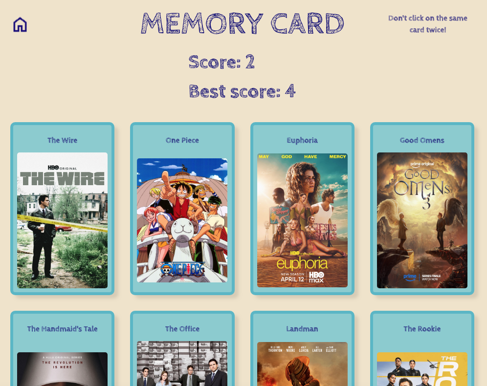

# Memory Card Game

Memory card game built with React (project from The Odin Project)

[live demo](https://evicno-memory-card.netlify.app/)

## Features

- **Card data fetched from the IMDB API** — top-rated TV series with 100k+ votes and a rating of 8+
- **Cards shuffle** after every click using the Fisher-Yates algorithm
- **Responsive grid layout** adapting to any number of cards
- Win/lose modal with score summary
- Best score tracking across rounds
- **Responsive design** (adapted for desktop, tablet and mobile)

## Built with

- **React** + **Vite**
- `useEffect` for data fetching
- `useState` for game state management

## What I learned

- Fetching and managing external API data with `useEffect`
- Difference between `useEffect` and `useState`
- Shuffling arrays with the Fisher-Yates algorithm
- Handling mobile viewports with `dvh`

## Credits

<a href="https://www.flaticon.com/free-icons/television" title="television icons">Television icons created by Freepik - Flaticon</a>
